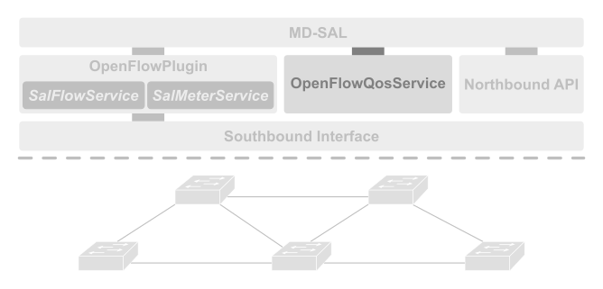

# Arqueopterix SDN controller OpenFlowQoS service

Arqueopterix OpenFlowQoS is an OpenDaylight bundle that provides a simplified API to allow other bundles or third party applications to manage the quality of service level that the underlying network provides to a specified network flow.



**Figure 1: Arqueopterix SDN controller architecture.**

The following YANG model defines the RPC call available for third party bundles to modify network configuration:
```
rpc set - qos - level {
  input {
    leaf src - port {
      description "Flow source port.";
      type uint16;
    }

    leaf dst - port {
      description "Flow destination port.";
      type uint16;
    }

    leaf src - addr {
      description "Flow IPv4 source address.";
      type inet: ipv4 - prefix;
    }

    leaf dst - addr {
      description "Flow IPv4 destination address.";
      type inet: ipv4 - prefix;
    }

    leaf protocol {
      description "IANA transport level protocol identifier.";
      type uint16;
    }

    leaf service - level {
      description "QoS level to apply to the corresponding flow.";
      type uint16;
    }

    leaf additional - info {
      description "Q4S alert SDP descriptor.";
      type string;
    }
  }
  output {
    leaf code {
      type uint8;
    }
    leaf message {
      type string;
    }
  }
}
```
## Build instructions

To build this module a machine with the following requirements is necessary:
 * JDK 1.8+
 * Maven 3.5+

The following command compiles the code and installs the generated bundles to the local Maven repository:

```sh
mvn clean install -DskipTests
```
> The option _-DskipTests_ is used in order to prevent test execution until proper testing is implemented in this module.

## Running the controller

Even though this source code generates a distributable OpenDaylight Nitrogen SR3 it is not very useful by itself as it just provides an API for other modules to use. In order to test a complete system it is recommended to download and compile the bundle Arqueopterix Northbound API.
